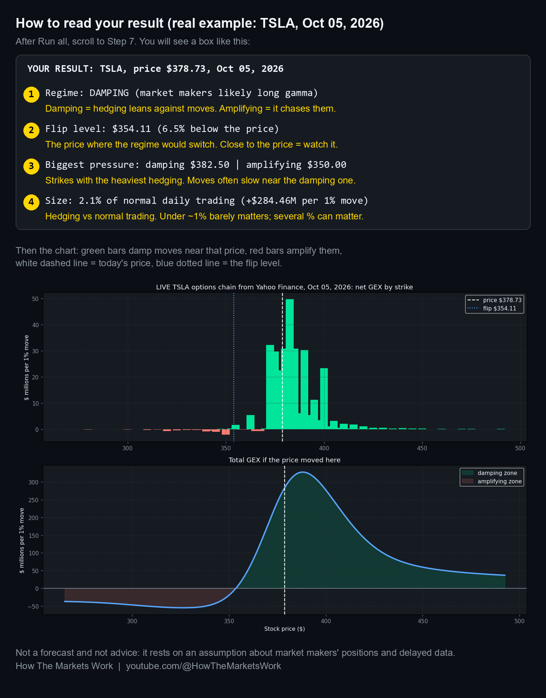

# Episode 001: Roaring Kitty vs Wall Street: The Real GameStop Story

The video: [How The Markets Work on YouTube](https://www.youtube.com/@HowTheMarketsWork)

## Run it in your browser (free, no install)

[](https://colab.research.google.com/github/HowTheMarketsWork/notebooks/blob/main/001-roaring-kitty-vs-wall-street/gex_calculator.ipynb) [](https://mybinder.org/v2/gh/HowTheMarketsWork/notebooks/main?labpath=001-roaring-kitty-vs-wall-street%2Fgex_calculator.ipynb)

- **Open in Colab**: one click, runs in seconds on Google's machines (needs a Google sign-in). Then click *Runtime > Run all*.
- **Launch Binder**: no account at all; takes a minute or two to start.

## What's here

**[gex_calculator.ipynb](gex_calculator.ipynb)**: type any US ticker with listed options and it tells you whether market makers' hedging is likely to **damp** or **amplify** that stock's moves today, the **price where that flips**, the **strikes with the most hedging pressure**, and how big that hedging is next to the stock's normal daily trading, all in plain English. Each step explains what it does and why, so you learn how the number is built.

**How to use it:** Open in Colab, type any ticker (and optionally a future expiry date), click *Runtime > Run all*, then read the four numbered lines under **Your result**. The copy on GitHub shows a real example run (TSLA, 2026-10-05).



## Or run it on your own machine

```bash
pip install numpy scipy matplotlib pandas yfinance
jupyter notebook gex_calculator.ipynb
```

Then change the sample chain (strikes, open interest, volatility, days to expiry) and watch the regime flip.

## Read this first

- Live data comes from Yahoo Finance: free, delayed, and open interest updates once a day. If it can't load, the notebook falls back to a built-in **sample** chain and says so.
- The sign convention (dealers long the calls and short the puts customers trade) is an **assumption**. Real dealer
  positioning is not public, and a different assumption changes the answer.
- Educational material only. Not financial, investment, legal or tax advice.
